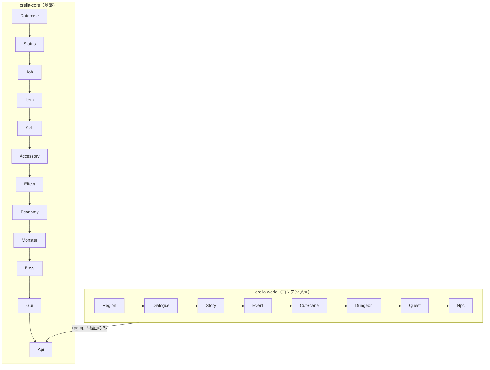

# 3プラグイン構成

Orelia は責務ごとに分割された複数の Paper プラグインで構成されます。

## orelia-core

戦闘・プレイヤー・ステータスの基盤プラグイン。以下のモジュールを持ちます。

Core, Item, Skill, Job, Status, Accessory, Monster, Boss, Effect, Economy, GUI, Database, API, Util

## orelia-world

コンテンツ層プラグイン。`depend: [OreliaCore]`、`softdepend: [Vault]`。

Quest, NPC, Dialogue, Story, Dungeon, Region, CutScene, Event

## orelia-extra（未実装）

Party, Guild, Trade などの後続 MMORPG 機能を予定。

## 統合ルール

- `orelia-world` / `orelia-extra` は `orelia-core` の内部モジュールクラス（`rpg.status.*`, `rpg.item.*` など）に直接アクセスしてはならない。
- 唯一の統合面は `rpg.api.*`（Bukkit `ServicesManager` 経由で公開）と、汎用インフラである `rpg.core.*` / `rpg.database.*`（`ConfigManager`, `SchedulerService`, `PlayerDataManager`, `PlayerDataComponent`, `DatabaseManager`, `SchemaOwner`）。
- お金のやり取り（クエスト報酬、NPCショップなど）は Vault の `Economy` を直に使う。専用の EconomyApi は存在しない。
- 各プラグインはそれぞれ独自の `ConfigManager` / `SchedulerService` インスタンスを持つ（共有インフラの実装を再利用しているだけで、プロセスは共有しない）。

両プラグインとも、モジュールシステム・Config・コマンド体系は同じ設計パターンを踏襲しています。詳細は以下を参照してください。

- [モジュールライフサイクル](module-lifecycle.md)
- [Config システム](config.md)
- [データベース層](database.md)
- [プレイヤーデータ](player-data.md)
- [コマンド体系](commands.md)
