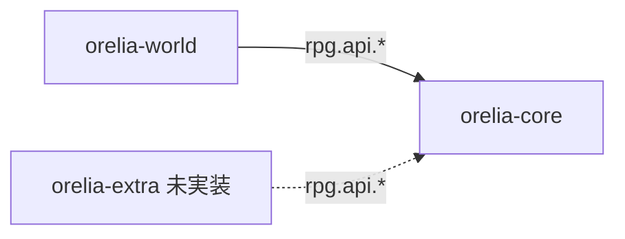

# Orelia Documentation

**Orelia** は Paper 1.21.x (Java 21) 向けの Minecraft RPG プラグイン群です。単一の巨大プラグインではなく、責務ごとに分割された複数プラグインの構成になっています。

| プラグイン | 役割 | 状態 |
|---|---|---|
| [orelia-core](core/index.md) | 戦闘・プレイヤー・ステータスの基盤（Item, Skill, Job, Status, Accessory, Monster, Boss, Effect, Economy, GUI, Database, API） | 実装済み |
| [orelia-world](world/index.md) | コンテンツ層（Quest, NPC, Dialogue, Story, Dungeon, Region, CutScene, Event） | 実装済み |
| orelia-extra | 後続 MMORPG 機能（Party, Guild, Trade, ...） | 未実装 |

`orelia-world` は `orelia-core` に依存し（`depend: [OreliaCore]`）、**`rpg.api` パッケージ経由でのみ** `orelia-core` と通信します。内部モジュールクラスへ直接アクセスすることはありません。



## このドキュメントの構成

- **[アーキテクチャ](architecture/overview.md)** — 2プラグイン共通のモジュールシステム、Config、データベース、プレイヤーデータ、コマンド体系
- **[orelia-core](core/index.md)** — 各ゲームプレイモジュールの仕様と `rpg.api` 公開APIリファレンス
- **[orelia-world](world/index.md)** — Quest / NPC / Dialogue / Story / Dungeon / Region / CutScene / Event の仕様

## ビルド

```bash
./gradlew build
```

両プラグインとも `repo.papermc.io`（Paper API）と `jitpack.io`（Vault API、および orelia-world は orelia-core も jitpack 経由で解決）へのネットワークアクセスが必要です。

## リロード

- `orelia-core`: `/oladmin reload`
- `orelia-world`: `/rpgworldadmin reload`

いずれもサーバー再起動なしに全モジュールの設定ファイルを再読込します。
